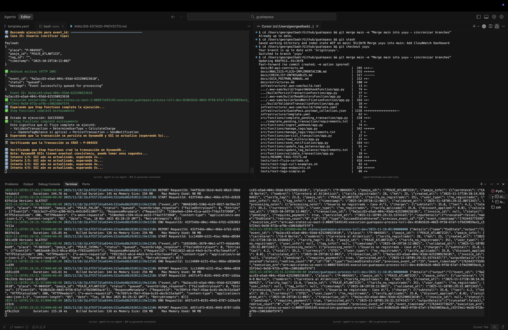
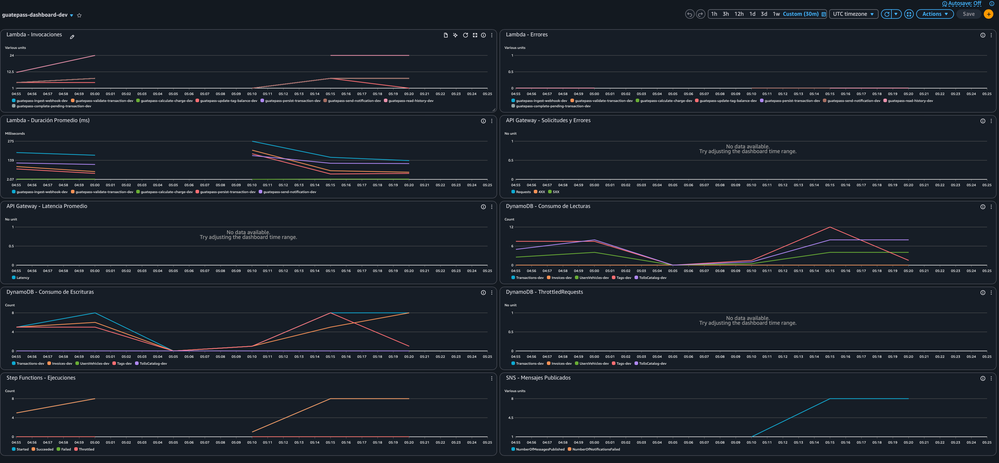

# GuatePass – Sistema de Cobro Automatizado de Peajes
**Proyecto Final – Infraestructura Cloud Serverless (AWS)**  
**Universidad Francisco Marroquín (UFM)**  
**Entrega: 17 de noviembre de 2025**  

## 1. Visión General del Proyecto

GuatePass moderniza el sistema de cobro de peajes mediante una arquitectura **serverless event-driven** que procesa transacciones de vehículos en tiempo real.  
Cada evento simula el paso de un vehículo por un peaje y ejecuta un flujo inteligente que:
- Determina la modalidad del usuario (no registrado, registrado o con Tag).
- Calcula el cobro aplicando tarifas dinámicas.
- Persiste la transacción en DynamoDB.
- Notifica al usuario y actualiza dashboards de monitoreo.

El objetivo es lograr **escalabilidad, resiliencia, y mínima latencia**, siguiendo las **mejores prácticas del AWS Well-Architected Framework**.

## 2. Justificación Arquitectónica

### Decisión Principal: Arquitectura Híbrida
El sistema combina un **flujo síncrono** (respuesta rápida al webhook) y **procesamiento asíncrono** mediante **EventBridge + Step Functions**, garantizando:
- Escalabilidad horizontal automática.
- Alta disponibilidad sin servidores.
- Aislamiento de fallas.
- Trazabilidad de eventos (`event_id` en logs).

### Principios Aplicados
- **Event-Driven Design:** cada etapa del flujo es un evento independiente.
- **Infrastructure as Code (IaC):** implementación con **AWS SAM**.
- **Observabilidad:** métricas y logs centralizados en **CloudWatch**.
- **Seguridad:** IAM Roles de privilegios mínimos (least privilege).

## 3. Arquitectura Técnica


**Flujo General:**
1. API Gateway recibe eventos `POST /webhook/toll`.
2. EventBridge enruta a `ProcessTollStateMachine`.
3. Step Functions orquesta validación, cobro y persistencia.
4. DynamoDB almacena usuarios, tags, transacciones e invoices.
5. SNS notifica resultados simulados.
6. CloudWatch concentra métricas y logs.
7. (Opcional) UI React/S3 consulta los endpoints `GET`.

## 4. Componentes AWS y Roles

| Servicio | Rol | Tipo |
|-----------|------|------|
| API Gateway | Exposición de endpoints REST (ingesta y consulta) | Front Layer |
| AWS Lambda | Validación y consultas específicas | Compute |
| EventBridge | Bus de eventos para comunicación desacoplada | Middleware |
| Step Functions | Orquestación del flujo de cobro | Workflow |
| DynamoDB | Base de datos NoSQL principal | Data |
| SNS | Notificaciones simuladas | Communication |
| CloudWatch | Logs, alarmas, métricas y dashboards | Monitoring |
| SAM / CloudFormation | Infraestructura como código | IaC |

## 5. Estructura del Repositorio

```
guatepass/
├─ README.md
├─ docs/
│  ├─ 00-vision.md / 01-adr-architecture.md
│  ├─ 02-api-contracts.md / 03-event-schemas.md / 04-observability.md
│  ├─ GUIA_POSTMAN_MANUAL.md, CHECKLIST-ENTREGABLES.md, etc.
│  └─ dashboard/
│     └─ README.md                   # Cómo abrir el dashboard de CloudWatch
├─ infrastructure/
│  ├─ template.yaml                  # SAM (todos los recursos)
│  ├─ DEPLOY.md / samconfig.toml / events/
│  └─ setup.sh                       # script de prerequisitos
├─ scripts/
│  └─ load_csv_data.py               # utilidades opcionales
├─ src/
│  └─ functions/                     # Lambdas (ingest, compute, notify, etc.)
├─ tests/
│  ├─ webhook_test.json              # 30 casos masivos de webhook
│  ├─ test_webhook.sh                # script básico de smoke tests
│  ├─ test-flujo-completo-mejorado.sh# usa webhook_test.json
│  └─ diagnose-transaction-flow.sh   # debugging asistido
└─ data/
   ├─ clientes.csv                   # carga inicial de usuarios
   └─ tolls_catalog.json             # catálogo de peajes
```

## 6. Despliegue y Ejecución

### Prerrequisitos
- AWS CLI v2 y SAM CLI instalados.  
- Credenciales AWS configuradas (`aws configure`).  
- Permisos para API Gateway, Lambda, Step Functions, DynamoDB, SNS y CloudWatch.  

### Comandos
```bash
cd infrastructure
sam build
sam deploy --guided
```

SAM imprimirá las URLs de los endpoints públicos tras el despliegue.

## 7. Pruebas Funcionales

### Endpoint de Ingesta
```bash
curl -X POST https://<api>.amazonaws.com/dev/webhook/toll   -H "Content-Type: application/json"   -d '{"placa":"P-123ABC","peaje_id":"PEAJE_ZONA10","tag_id":"TAG-001","timestamp":"2025-11-12T10:00:00Z"}'
```
**Respuesta esperada:**
```json
{ "event_id": "uuid", "status": "queued" }
```

### Endpoints de Consulta
```bash
GET /history/payments/P-123ABC
GET /history/invoices/P-123ABC
```

### Dataset y scripts de prueba
- `tests/webhook_test.json` contiene **30 escenarios** (usuarios con tag, registrados y no registrados) que alimentan los scripts de pruebas manuales.
- `tests/test-flujo-completo-mejorado.sh` y `tests/test_webhook.sh` leen este dataset para automatizar las llamadas `curl` después del deploy.

## 8. Observabilidad y Monitoreo

**Dashboard de CloudWatch (`guatepass-dashboard-<stage>`)**  
Se crea automáticamente desde el template (`MonitoringDashboard`) e incluye:
- Invocaciones, errores y duración de todas las Lambdas (`ingest`, `validate`, `calculate`, `persist`, `notify`, `read_history`, `complete_pending`, `update_tag_balance`).
- Requests, latencia y errores 4xx/5xx de API Gateway (`ApiId` + `Stage`).
- Consumo de lecturas/escrituras y throttles para `Transactions`, `Invoices`, `UsersVehicles`, `Tags` y `TollsCatalog`.
- Ejecuciones/errores del Step Function `guatepass-process-toll-<stage>`.
- Mensajes publicados y fallidos en el topic `Notifications-<stage>`.




Para abrirlo:
```bash
aws cloudwatch get-dashboard \
  --dashboard-name guatepass-dashboard-dev \
  --query 'DashboardBody' --output text | jq
```
o desde la consola (**CloudWatch → Dashboards**). Detalles adicionales en `docs/dashboard/README.md`.

**Logs estructurados:**  
Cada Lambda escribe en su grupo `/aws/lambda/guatepass-*-<stage>`; Step Functions en `/aws/stepfunctions/guatepass-process-toll-<stage>` con retención de 14 días. Usa `aws logs tail <log-group> --follow` para diagnóstico rápido.

## 9. Buenas Prácticas de Implementación

- Mantener Lambdas pequeñas y de propósito único.  
- Desacoplar completamente las capas de ingesta y procesamiento.  
- Usar logs estructurados (JSON) con `event_id`.  
- Aplicar GitFlow para versionamiento (`main`, `dev`, `infra`).  
- Configurar IAM Roles específicos y restrictivos.  
- Habilitar DLQs y retries automáticos para resiliencia.  

## 10. Equipo GuatePass

| Integrante | Rol | Responsabilidad Principal |
|-------------|------|---------------------------|
| Milton Beltrán | Líder técnico / Infraestructura | IaC, despliegue y orquestación |
| George Albadr | Backend | Step Functions y lógica de cobro |
| Ximena Díaz | Monitoreo y QA | CloudWatch, testing y documentación |
